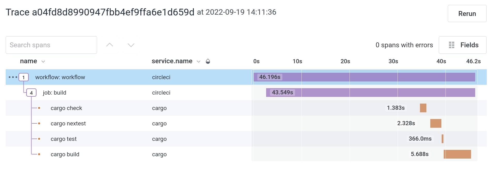

# CircleCI OTEL Webhook Processor

This service receives, converts and forwards [CircleCi](https://circleci.com/) webhook events to an [OpenTelemetry](https://opentelemetry.io/) collector. This can be useful to enhance your insights into whatever you're running on CircleCI by giving you detailed traces of jobs and workflows, and connecting them to the code running in the CI jobs.

# Operation

In the most basic configuration, Circle CI sends webhook events for each finished Job and Workflow to the circleci-hook-server, which translates the payload and forwards the results on to a opentelemetry-collector. Depending on your preferred stack, there's different options for where to run the server, and what collector to use. 


For capturing this project's CI, I've set up a free-tier CircleCI account for running CI, a free-tier [fly.io](https://fly.io) account to run the server, and a free-tier [Honeycomb](https://honeycomb.io) account to capture and visualise the results.

# Configuration

Since there's a lot of flexibility in which services to use to run, the docs below only show one specific way to do so with (as of September'22) free services.

## Register with Honeycomb

* https://ui.honeycomb.io/signup

You'll need to remember the API key for later.

## Running the service on fly.io

* [Install flyctl](https://fly.io/docs/hands-on/install-flyctl/)
* [Sign Up](https://fly.io/docs/hands-on/sign-up/)
* [Sign In](https://fly.io/docs/hands-on/sign-in/)

Now the server can be deployed, by running `flyctl deploy` command from a checkout of this repo. The first time around, `flyctl` will ask for a few questions for the first-time set up the application, and then build and deploy [the server image](Dockerfile).

The first deploy will fail, as the server requires some configuration to work:

|Name|Required|Usage|
|-|-|-|
|`CIRCLECI_HOOK_SECRET`|Y|This secret authenticates CircleCI to this service. Use a randomly generated string, e.g. the output of `pwgen 32`. ([pwgen](https://packages.debian.org/bullseye/pwgen)).|
|`CIRCLECI_HOOK_SERVICE`|N|The service name used for traces sent to OpenTelemetry. Defaults to `'circleci'`.|
|`CIRCLECI_OTLP_ENDPOINT`|Y|The URL for the collector. Equivalent to [`OTEL_EXPORTER_OTLP_ENDPOINT`](https://github.com/open-telemetry/opentelemetry-specification/blob/main/specification/protocol/exporter.md#endpoint-urls-for-otlphttp) for other services.|
|`CIRCLECI_OTLP_*`|N|All other variables starting with `CIRCLECI_OTLP_` will be passed through as headers to the collector. This can be used for authentication.|

To configure the service use `flyctl secrets set`:

```shell
❯ flyctl secrets set CIRCLECI_HOOK_SECRET=RANDOM_STRING CIRCLECI_OTLP_ENDPOINT=https://api.honeycomb.io CIRCLECI_OTLP_X_HONEYCOMB_TEAM=HONEYCOMB_API_KEY
```

This will trigger a new deployment, which should leave you with a running service. Here is a deployment on an already set-up application:

```shell
❯ flyctl deploy
==> Verifying app config
--> Verified app config
==> Building image
Remote builder fly-builder-frosty-pond-2051 ready
==> Creating build context
--> Creating build context done
==> Building image with Docker
--> docker host: 20.10.12 linux x86_64
Sending build context to Docker daemon  601.6kB
[+] Building 4.5s (14/14) FINISHED
 => [internal] load remote build context  0.0s
 => copy /context /  0.1s
 => [internal] load metadata for docker.io/library/rust:1.63-slim-bullseye  0.8s
 => [internal] load metadata for docker.io/library/debian:11.4-slim  0.8s
 => [builder 1/5] FROM docker.io/library/rust:1.63-slim-bullseye@sha256:2bfce600f8e11779fcff44f7a9e38b  0.0s
 => [stage-1 1/4] FROM docker.io/library/debian:11.4-slim@sha256:68c1f6bae105595d2ebec1589d9d476ba2939  0.0s
 => CACHED [builder 2/5] RUN apt update && apt install -y protobuf-compiler  0.0s
 => CACHED [builder 3/5] WORKDIR /app  0.0s
 => [builder 4/5] COPY . .  0.1s
 => [builder 5/5] RUN --mount=type=cache,target=/app/target   --mount=type=cache,target=/usr/local/car  3.4s
 => CACHED [stage-1 2/4] RUN set -eux;     export DEBIAN_FRONTEND=noninteractive;     apt update;  0.0s
 => CACHED [stage-1 3/4] WORKDIR app  0.0s
 => CACHED [stage-1 4/4] COPY --from=builder /app/circleci-hook-server ./circleci-hook-server  0.0s
 => exporting to image  0.0s
 => => exporting layers  0.0s
 => => writing image sha256:9e2f6379ced0da568486dc1158f4a606ed97f81db1d2f9960cd7ba5e32681a42  0.0s
 => => naming to registry.fly.io/circleci-hook:deployment-01GDB32FZ7SX7CSRJY270C67X5  0.0s
--> Building image done
==> Pushing image to fly
The push refers to repository [registry.fly.io/circleci-hook]
3d12660aa8f0: Layer already exists
e88e1a82a29c: Layer already exists
0374d3eca220: Layer already exists
6485bed63627: Layer already exists
deployment-01GDB32FZ7SX7CSRJY270C67X5: digest: sha256:6b15263be96b903f78f48e72c012d76a21090c19cffdff1e4bb7179e3b6f523b size: 1159
--> Pushing image done
image: registry.fly.io/circleci-hook:deployment-01GDB32FZ7SX7CSRJY270C67X5
image size: 160 MB
==> Creating release
--> release v8 created

--> You can detach the terminal anytime without stopping the deployment
==> Monitoring deployment

 1 desired, 1 placed, 1 healthy, 0 unhealthy
--> v8 deployed successfully

❯
```

Reference: [flyctcl deploy](https://fly.io/docs/flyctl/deploy/).

## Circle CI to Hook Server

Now that the service is running, you can configure the webhook to speak to it. See the [CircleCI Webhooks docs](https://circleci.com/docs/webhooks) for all the mechanics. The Receiver URL is the URL to the service as found in the [fly.io dashboard](https://fly.io/dashboard).


Once the configuration is saved, you can send a test event using the "Test Ping Event" botton on the configuration dialog. If everything is set up correctly, the request shows up in the log in the monitoring section of your application on fly.io.

```
2022-09-19T15:59:36.598 app[2bde2902] lhr [info] 2022-09-19T15:59:36.597076Z INFO hook_handler{state=AppState { tracer: Tracer { name: "opentelemetry-otlp", version: Some("0.11.0") } } headers={"x-request-start": "t=1663603176559580", "user-agent": "CircleCI-Webhook/1.0", "circleci-event-type": "ping", "circleci-signature": "v1=3e8f6ad0f07053e506055a94f57c4be027465ddbe915f131057a862e73930ed7", "content-type": "application/json", "accept-encoding": "gzip, deflate", "content-length": "175", "host": "circleci-hook.fly.dev", "fly-client-ip": "52.206.105.184", "x-forwarded-for": "52.206.105.184, 168.220.95.185", "fly-forwarded-proto": "https", "x-forwarded-proto": "https", "fly-forwarded-ssl": "on", "x-forwarded-ssl": "on", "fly-forwarded-port": "443", "x-forwarded-port": "443", "fly-region": "iad", "fly-request-id": "01GDB7KX3FFW3VKT9367F47GYX-iad", "via": "1.1 fly.io", "fly-traceparent": "00-326287b330c83a8bf4623012aebfaa6d-d31e86f8cfa0d036-00", "fly-tracestate": ""} body=b"{\"type\":\"ping\",\"id\":\"92e0554a-837f-4086-913b-0dc7665d2a84\",\"happened_at\":\"2022-09-19T15:59:36.507435Z\",\"webhook\":{\"id\":\"d4ab06bc-eb79-463d-8aa4-47d066382d3b\",\"name\":\"fly.io\"}}"}: circleci_hook_app::payload: Processing PingEvent 
```


Shortly thereafter, the trace will show up at the "Recent Traces" section at the bottom of Honeycomb's Home screen for your environment.


This now provides you with basic service and pipeline results will show up in honeycomb.

## Circle CI to OpenTelemetry

Since the CircleCI service is very restrained in the data it provides through the webhooks, there's a need for more detailed information gathering.

A good option to capture this information is [otel-cli](https://github.com/equinix-labs/otel-cli), to use it in your pipelines, add the following steps:

```
steps:
    - run:
        name: configure traceparent
        command: curl "${HOOK_URL}/traceparent/${CIRCLE_WORKFLOW_ID}/${CIRCLE_WORKFLOW_JOB_ID}" >> "$BASH_ENV"
    - run:
        name: install otel-cli
        command: |
        curl -L https://github.com/equinix-labs/otel-cli/releases/download/v0.0.20/otel-cli-0.0.20-Linux-x86_64.tar.gz | sudo tar xvzf - -C /usr/local/bin
```

The first step sets up the `TRACEPARENT` variable, so all spans created with `otel-cli` are connected to the span of the currently running job. The second step installs the `otel-cli` binary.

To make it talk to your new service, set the following environment variables in your CircleCI config ([docs](https://circleci.com/docs/env-vars#setting-an-environment-variable-in-a-project)):

|Name|Required|Usage|
|-|-|-|
|`HOOK_URL`|Y|The URL of your hook service. This is used to calculate the correct trace and span IDs.|
|`OTEL_EXPORTER_OTLP_ENDPOINT`|Y|The URL for the collector. See [the OpenTelemetry specs](https://github.com/open-telemetry/opentelemetry-specification/blob/main/specification/protocol/exporter.md#endpoint-urls-for-otlphttp) for details.|
|`OTEL_EXPORTER_OTLP_HEADERS`|N|Pass key-value pairs as headers to the OpenTelemetry collector.|

You can use other environment variables to configure how otel-cli authenticates to your collector. For Honeycomb, set `OTEL_EXPORTER_OTLP_HEADERS` to pass through your dataset name and api token:

```
OTEL_EXPORTER_OTLP_HEADERS="x-honeycomb-dataset=circleci,x-honeycomb-team=HONEYCOMBAPITOKEN"
```

# Example Results

The [pipeline for this repository](.circleci/config.yml) has a few `otel-cli` calls. In Honeycomb, this looks like this:


